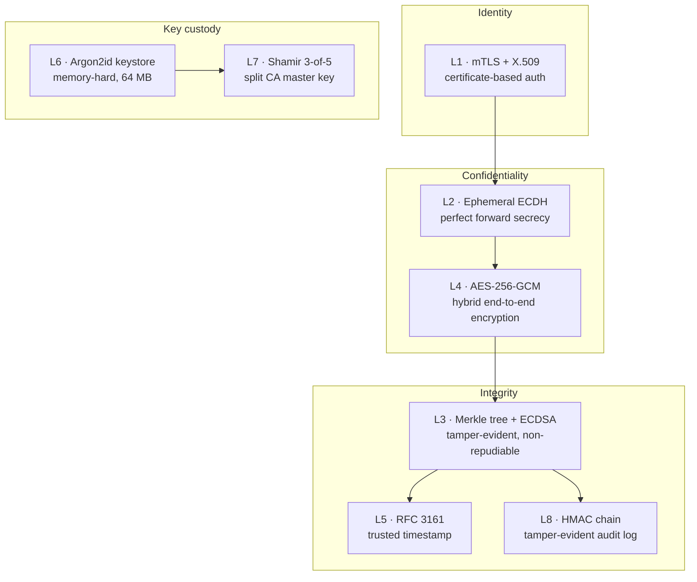
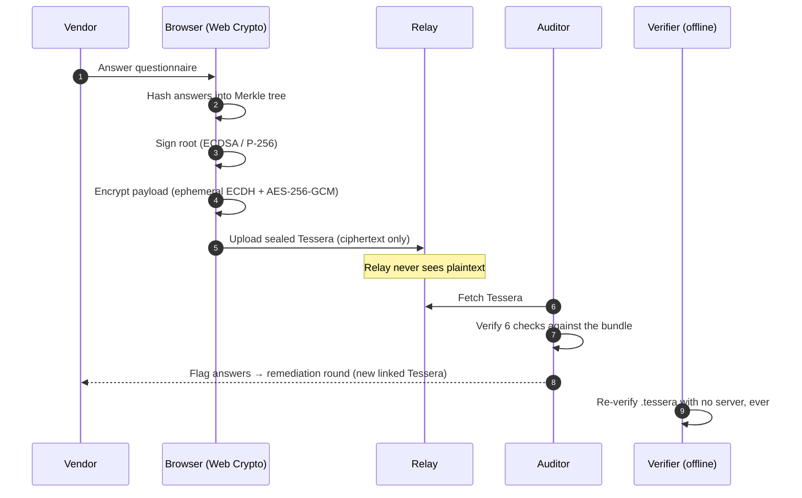
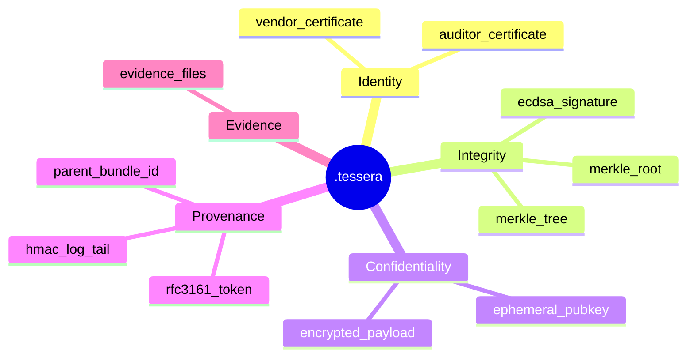
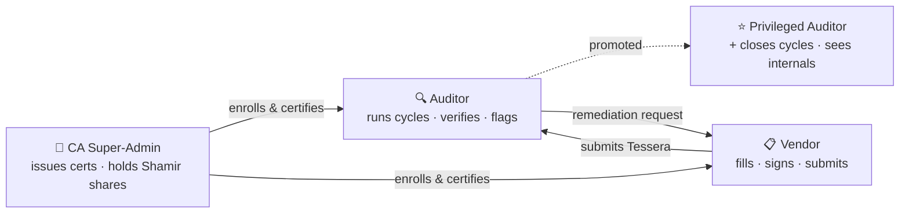
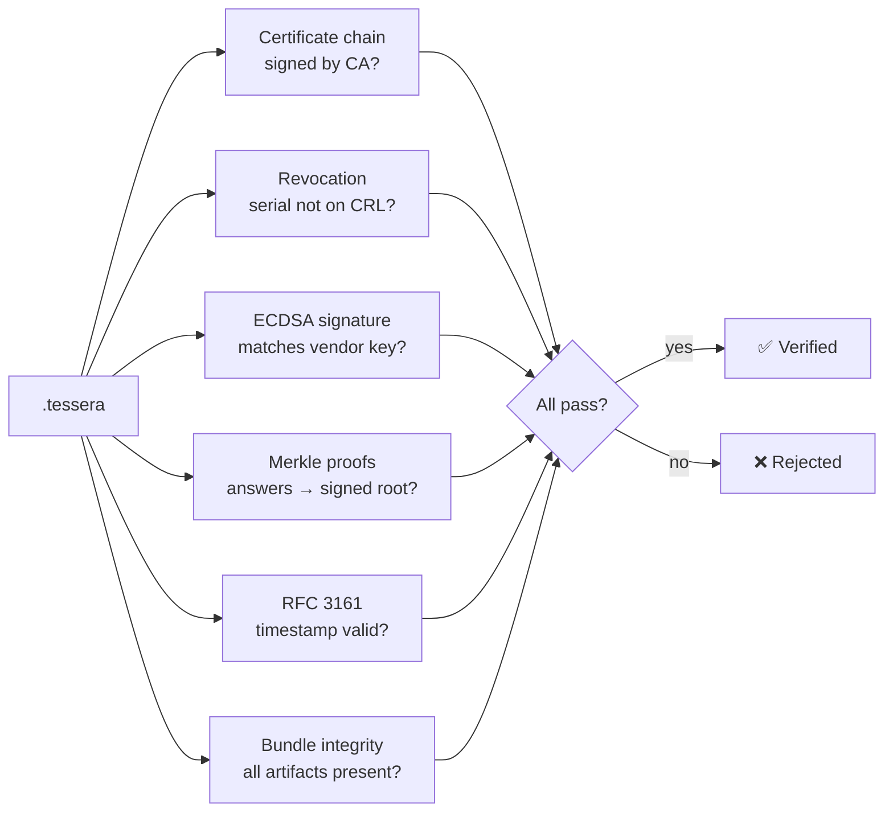
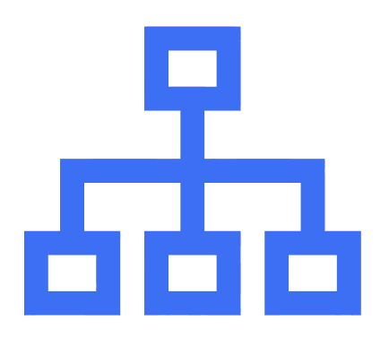

<div align="center">


### Stop trusting spreadsheets. Trust math.

A zero-trust platform for third-party security audits, where every submission is a cryptographically sealed, independently verifiable bundle instead of an email attachment you have to take on faith.

<br/>


</div>

---

## What is this?

Third-party risk questionnaires (SOC 2, ISO 27001) are still exchanged as spreadsheets over email. The receiving auditor has no way to prove the answers were not altered in transit, and no cryptographic proof of who actually authored them.

**Attestr** rebuilds that workflow so trust is replaced by verifiable evidence. A vendor's answers are hashed into a Merkle tree, signed with the vendor's own key, encrypted end-to-end for the auditor, and timestamped. The resulting artifact, a **Tessera** (`.tessera`), can be verified by anyone, offline, forever, with no access to the platform that produced it.

> The core promise: change a single byte of a submitted answer, and verification fails. Provably.

<div align="center">

| Old way | Attestr |
|:--|:--|
| Spreadsheet over email | Sealed `.tessera` bundle |
| "Trust that it's unchanged" | Merkle proof: tamper = fail |
| "Trust who sent it" | ECDSA signature = non-repudiation |
| Readable by any relay in between | AES-256-GCM, end-to-end |
| Verification tied to a vendor's server | Verifiable offline, no platform |

</div>

---

## The eight layers

Attestr is organized as eight cooperating cryptographic layers. Each one is real and exercised in the workflow, not decorative.



<div align="center">

| # | Layer | What it guarantees |
|:-:|:--|:--|
| 1 | mTLS + X.509 | You are who your certificate says you are. No passwords. |
| 2 | Ephemeral ECDH | Past submissions stay secret even if a long-term key later leaks. |
| 3 | Merkle + ECDSA | Answers cannot be altered, and the signer cannot deny signing. |
| 4 | AES-256-GCM hybrid | Only the intended auditor can read the answers. |
| 5 | RFC 3161 timestamp | Submission time cannot be forged or backdated. |
| 6 | Argon2id keystore | Keys at rest resist GPU brute force. |
| 7 | Shamir 3-of-5 | No single admin can wield the CA master key alone. |
| 8 | HMAC audit chain | History cannot be silently rewritten. |

</div>

---

## How a submission flows



Every submission produces a self-contained bundle:



---

## Roles



- **CA Super-Admin** is the root of trust: issues X.509 certificates, approves vendor access, and custodies the Shamir-split master key.
- **Auditors** create questionnaires, verify Tesseras, and flag answers for remediation. **Privileged** auditors additionally close cycles and inspect bundle internals.
- **Vendors** answer questionnaires and produce signed, encrypted submissions.

Auditors are grouped into **workspaces** (firms). A workspace only sees the vendors assigned to it, so multiple firms can share one deployment in complete isolation.

---

## Quick start

> Requires Docker and Docker Compose. The frontend runs natively on Node 20 for fast hot-reload.

```bash
git clone https://github.com/shirshxk/attestr.git
cd attestr

# Backend + mail catcher in Docker
make setup && make run

# Frontend (separate terminal, native)
cd frontend && npm install && npm run dev
```

<div align="center">

| Service | URL |
|:--|:--|
| Frontend | http://localhost:5173 |
| API | http://localhost:8000 |
| API docs (Swagger) | http://localhost:8000/docs |
| Mail catcher (Mailhog) | http://localhost:8025 |

</div>

On first boot the platform seeds a demo cast automatically: **Elastic** and **Airtable** (auditors), **Grammarly** and **Plaid** (vendors), plus the **CA super-admin**.

> [!TIP]
> Always open the app at **localhost**, not a raw Docker IP. Browser cryptography (`crypto.subtle`) and clipboard access only work on `localhost` or HTTPS.

<details>
<summary><b>Common commands</b></summary>

<br/>

```bash
make run       # start backend + mailhog
make stop      # stop everything
make test      # run the full test suite (39 tests)
make clean     # tear down containers AND wipe the data volume
make benchmark # run the cryptographic benchmark suite
```

To reset to a pristine demo state (no test users, empty pipeline):

```bash
make stop
docker compose down -v   # -v wipes the database volume
make setup && make run   # re-seeds only the demo orgs
```

</details>

---

## Verifying a Tessera

The whole point is that verification needs nothing but the file. Six independent checks, each provable against the bundle itself:



There is a built-in **offline verifier** page that re-computes every hash in JavaScript, byte-for-byte identical to the Python backend, so a Tessera can be verified years later with no running server.

---

## Repository layout

```
attestr/
├── backend/                 FastAPI service
│   ├── crypto/              ecc · signing · merkle · encryption · hybrid
│   ├── keystore/            argon2_kdf · shamir · rotation · store
│   ├── ca/                  authority · crl · timestamp (RFC 3161)
│   ├── audit/               bundle assembly · verify · hmac_log
│   ├── questionnaire/       builder · templates · importers
│   ├── remediation/         signed remediation-round chain
│   ├── api/                 routers (auth, admin, workspaces, bundle, …)
│   └── tests/               39 tests across 7 suites
├── frontend/                React 18 + Vite + Tailwind
│   └── src/pages/           Admin · Auditor · Vendor · Enroll · OfflineVerifier
├── docker-compose.yml
└── Makefile
```

<details>
<summary><b>Where the cryptography actually lives</b></summary>

<br/>

| Concern | File |
|:--|:--|
| Merkle tree + leaf hashing | `backend/crypto/merkle.py` |
| ECDSA signing / verification | `backend/crypto/signing.py` |
| Hybrid ECDH → HKDF → AES-GCM | `backend/crypto/hybrid.py` |
| Shamir secret sharing (GF 256) | `backend/keystore/shamir.py` |
| Argon2id keystore | `backend/keystore/argon2_kdf.py` |
| Mini CA + CRL | `backend/ca/authority.py`, `backend/ca/crl.py` |
| RFC 3161 timestamp | `backend/ca/timestamp.py` |
| HMAC audit chain | `backend/audit/hmac_log.py` |
| Bundle assembly + verify | `backend/audit/bundle.py`, `backend/audit/verify.py` |

</details>

---

## Tech stack

<div align="center">

| Layer | Choices |
|:--|:--|
| **Backend** | FastAPI · SQLAlchemy · `cryptography` (pyca) · Argon2 · PyJWT · APScheduler |
| **Frontend** | React 18 · Vite · Tailwind · Recharts · Web Crypto API |
| **Infra** | Docker Compose · Mailhog · SQLite |
| **Quality** | pytest (39 tests) · Ruff · GitHub Actions CI |

</div>

Why elliptic curve (P-256) over RSA? Smaller keys and signatures for equivalent security, faster signing, and a natural fit for ECDH key agreement, which is what makes the forward-secrecy design practical.

---

## Testing

```bash
make test
```

39 tests spanning the security-critical surface:

<div align="center">

| Suite | Covers |
|:--|:--|
| `test_merkle` | leaf determinism, tamper detection, odd-count trees |
| `test_signing` | ECDSA sign/verify, wrong-key and tampered-root rejection |
| `test_shamir` | 3-of-5 reconstruction, zero information leakage |
| `test_encryption` | AES-GCM round-trip, auth-tag tamper detection |
| `test_bundle` | full sign-and-verify pipeline, post-signing tamper |
| `test_remediation_chain` | each round independently verifiable |
| `test_security` | prod secret fail-fast, JWT tamper rejection, file-access control |

</div>

---

## Roadmap

- [x] Eight-layer cryptographic core
- [x] CSR-based enrollment (private keys never leave the browser)
- [x] Offline verifier with JS/Python hash parity
- [x] Remediation chain of custody
- [x] Security hardening pass + CI
- [ ] Hardware-backed keys (WebAuthn / FIDO2)
- [ ] Post-quantum signature exploration

---

## Security note

Attestr is an academic project built to demonstrate applied cryptography. It has not undergone independent security review and is not intended for production use as-is. Default development secrets are intentionally rejected when `ATTESTR_ENV=production`.

---

<div align="center">



**Attestr** — verifiable forever, no platform required.

<sub>Built as a capstone for the Practical Cryptography module.</sub>

</div>
